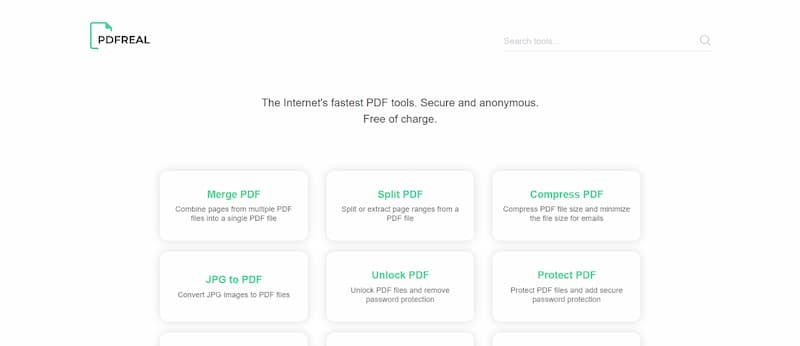
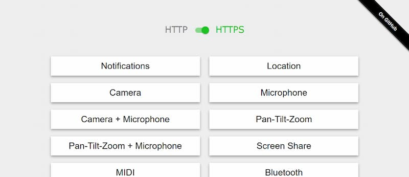
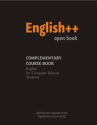

5、[SQLite 命令行数据处理示例](https://antonz.org/sqlite-is-not-a-toy-database/)（英文）

SQLite 是一个很强大的工具，很多人只把它当作数据库使用，却不知道它可以用在命令行，处理各种数据文件。

8、[如何清理 Docker？](https://dockerwebdev.com/tutorials/clean-up-docker/)（英文）

如果你大量使用 Docker，它会占用很多硬盘空间。本文教你如何彻底清理 Docker，包括清理容器文件、镜像文件、网络数据、虚拟磁盘等等。

1、[FicusJS](https://docs.ficusjs.org/index.html)

一个 Web Component 组件开发框架，看上去挺简单。

2、[Lite YouTube Embed](https://github.com/paulirish/lite-youtube-embed)

一个 Web Component 组件，用来快速加载 Youtube 视频，可以从它的源码学习 Web Component 组件的写法。

3、[PDFReal](https://pdfreal.com/)

该网站提供了一系列在线工具，用于 PDF 文件的各种处理。

1、[permission.site](https://github.com/chromium/permission.site)

该网站收集 Chrome 浏览器各种需要用户许可的场景（比如读取剪贴板、读取地理位置等），每个场景都提供可运行的示例。

[程序员的 IT 英语教材](https://englishplusplus.jcj.uj.edu.pl/index.html)

这是波兰某个大学的计算机专业英语教材，收集了一些 IT 方面的经典英语文章，用来提高非英语国家程序员的英语水平。

3、[在线匿名者指南](https://anonymousplanet.org/guide.html)

一本免费阅读的英文书籍，教你如何在网上不留下痕迹地进行访问，分为各种使用场景，内容比较深。\

