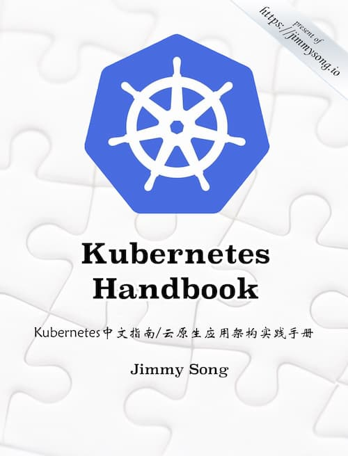

## 云服务相关

- [Linux 加固指南](https://madaidans-insecurities.github.io/guides/linux-hardening.html)（Linux Hardening Guide）

这篇英语长文整理了各种 Linux 的调整步骤，使得它变得更安全

- [Docker 指南](https://www.robertcooper.me/docker-guide)

一篇英文的 Docker 教程，解释最重要的一些概念，帮助读者学会使用 Docker 进行应用程序开发。

- [如何用 Podman 替代 Docker](https://developers.redhat.com/blog/2020/11/19/transitioning-from-docker-to-podman/)（英文）

Podman 是 RedHat 公司开发的容器引擎，用来替代 Docker。本文是一篇简单的上手指南。

- [我如何建立自己的 Kubernetes 集群](https://blog.quickbird.uk/domesticating-kubernetes-d49c178ebc41)（英文）

作者先介绍了 Kubernetes 的概念（分布式基础设施之上的虚拟系统层），然后介绍如何家用老电脑（上图）组建一个集群。

- [图灵派](https://turingpi.com/)（Turing Pi）

图灵派是树莓派的一个集群板，好比机房里面的一个机架，可以用来自己架设 Kubernetes 集群

- [deploy-your-own-saas](https://github.com/Atarity/deploy-your-own-saas)

该仓库收集可以自己部署的开源 SaaS 服务

- [Kubernetes 中文指南](https://jimmysong.io/kubernetes-handbook/)

本书是第一本系统整理的开源中文版 Kubernetes 参考资料，记录了本人从零开始学习和使用 Kubernetes 的历程，着重于总结和资料分享，同时也会有相关的概念解析
