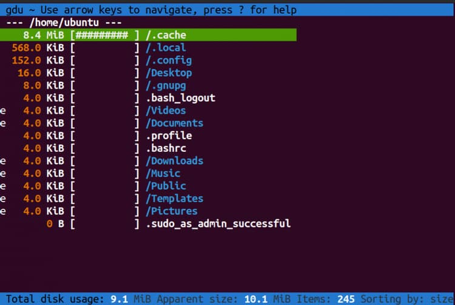
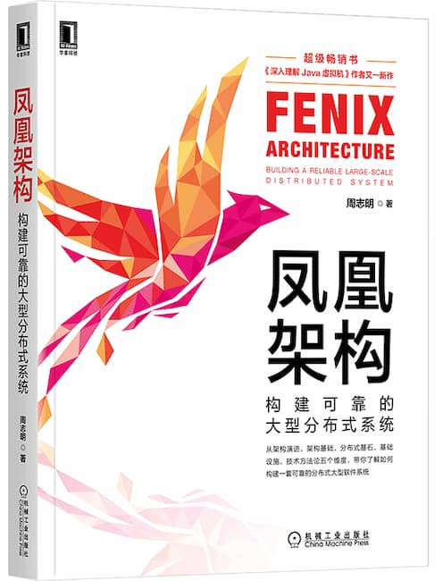

---

id: serivce

title: 服务学习

sidebar_label: 服务学习

---

[树莓派架设公网网站](https://viggy28.dev/article/setting-up-ghost-in-raspberry-pi-for-free/)（英文）

作家介绍如何在家庭网络之中，使用树莓派架设一个网站，然后通过端口映射，供外网访问

[Linux 系统的磁盘分析工具 gdu 用法](https://www.makeuseof.com/how-to-analyze-disk-usage-with-gdu-in-linux/)（英文）

gdu 是 du 命令的 Go 语言版，用来分析 Linux 和 MacOS 系统的磁盘占用情况，提升了执行速度，并且有命令行图形界面。

[Send](https://github.com/timvisee/send)

Mozilla 基金会曾经推出了一个文件分享服务，后来停止开发了。社区就接过来，做成完全的开源版，现在可以自己搭建，并且有 Web、命令行和安卓等各种客户端。

[Zulip](https://zulip.com/)

一个团队协作工具，将聊天和电子邮件的线程模型结合在一起，类似 Slack，但是更像一个内部论坛。

[凤凰架构](http://icyfenix.cn/)

一本中文的开源书籍，介绍如何构建一套可靠的分布式大型软件系统，可以免费阅读。

